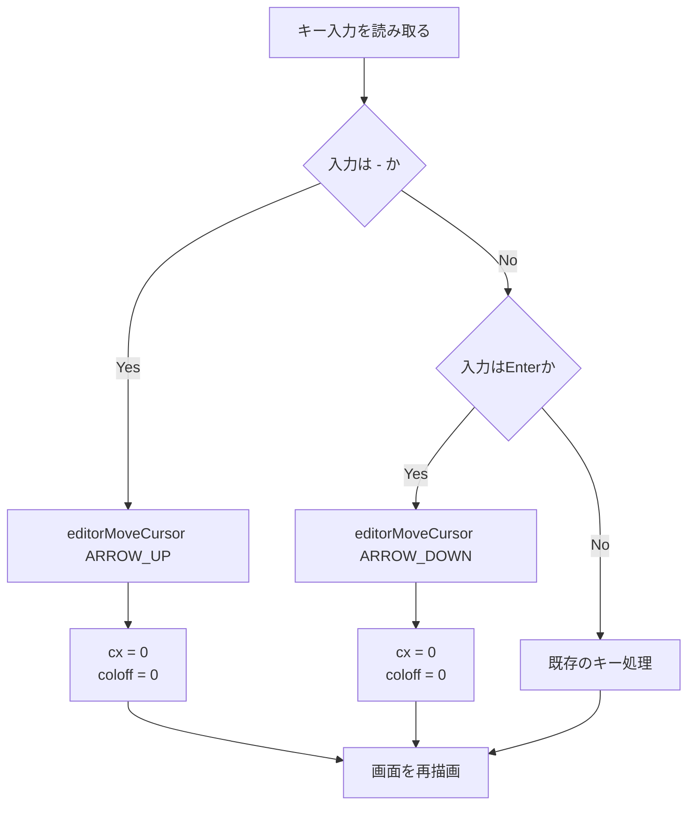
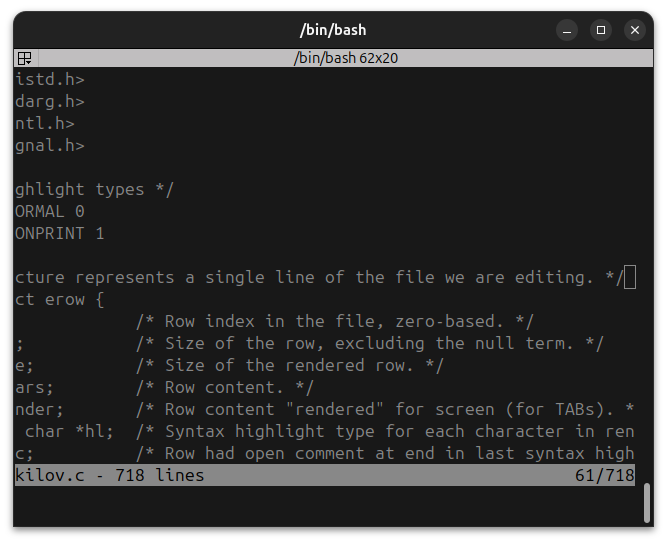
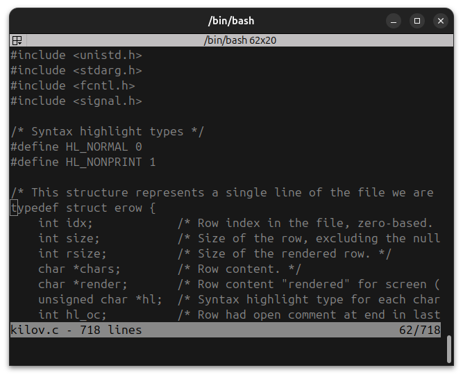
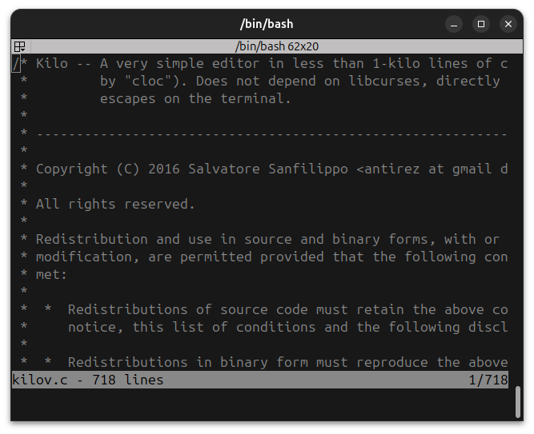
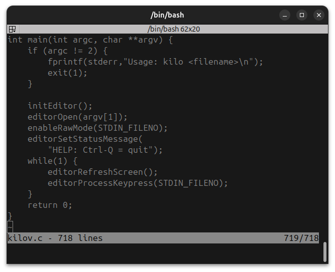

# 実験の目的
\sloppy
既存プログラムへの新規機能の追加。

- 実用的なプログラム/ソフトウェアの開発においては,使い捨てではなく,既存のソースコードや開発文書を再利用して機能を追加したり不具合を解消したりすることがほとんどです。
- 機能を追加したり不具合を解消したりするのは,必ずしも初期開発に携わった者とは限りません.
- 開発(保守)を継続するには,既存のソースコードや開発文書を理解・解析する必要があります.
- 本実験では,プログラム/ソフトウェアの保守過程を疑似的に体験し,対応するコードや文書を仕上げて提出してもらいます.
- 併せて,理解・解析の補助ツールとして,AI chatbot(ChatGPT,Gemini,Copilot,等)の適切な活用を学びます.

# 課題 1
## 起動方法と終了方法
- nanoなどと同様に、最初の引数のファイルを開くことができる。
- ccでコンパイルした場合、`./a.out <ファイル名>`で起動できる。
- 終了時は `Ctrl + Q` で終了できる。
- `Ctrl + C` や `Ctrl + D` 、 `Ctrl + \` などでは強制終了できない。

## スクリーン移動方法
- 上下左右矢印キーでカーソルを一文字づつ移動することができる。
- `PgUp`、`PgDn` でスクロール(＝ページ単位)での移動ができる。

# 課題 2
\begingroup
\tiny
| 機能 | 入/出 | エスケープシーケンス | 説明 |
|---|---|---|---|
| カーソルを上へ移動 | 入力 | `ESC[A` | 上へ移動 |
| カーソルを下へ移動 | 入力 | `ESC[B` | 下へ移動 |
| カーソルを右へ移動 | 入力 | `ESC[C` | 右へ移動 |
| カーソルを左へ移動 | 入力 | `ESC[D` | 左へ移動 |
| カーソルをホームへ移動 | 入力 | `ESC[H` または `ESCOH` | Homeキー |
| カーソルを行末へ移動 | 入力 | `ESC[F` または `ESCOF` | Endキー |
| Deleteキー | 入力 | `ESC[3~` | Deleteキー |
| PageUpキー | 入力 | `ESC[5~` | PageUpキー |
| PageDownキー | 入力 | `ESC[6~` | PageDownキー |
| カーソルを右端へ移動 | 出力 | `ESC[999C` | 右端へ移動 |
| カーソルを下端へ移動 | 出力 | `ESC[999B` | 下端へ移動 |
| カーソル位置の問い合わせ | 出力 | `ESC[6n` | 位置を問い合わせ |
| カーソル位置の報告 | 入力 | `ESC[n;mR` | n行m列を報告 |

\endgroup


# 課題 3
```c
struct editorConfig {
    int cx,cy;  /* Cursor x and y position in characters */
    int rowoff;     /* Offset of row displayed. */
    int coloff;     /* Offset of column displayed. */
    int screenrows; /* Number of rows that we can show */
    int screencols; /* Number of cols that we can show */
    int numrows;    /* Number of rows */
    int rawmode;    /* Is terminal raw mode enabled? */
    erow *row;      /* Rows */
    int dirty;      /* File modified but not saved. */
    char *filename; /* Currently open filename */
    char statusmsg[80];
    time_t statusmsg_time;
};
```

## cx, cy, rowoff, coloff
- `cx`, `cy` は現在表示している画面内でのカーソルの横位置と縦位置を表す。0から始まる値で、端末上の列番号とは1ずれている。
- `rowoff`, `coloff` は画面の最上段に表示しているファイル行の番号と、画面の左端に表示しているファイル上の文字位置を表す。
- `rowoff` はカーソルが画面の最上段や最下段を越えて移動すると、この値を変更して表示範囲を上下へスクロールする。
- `rowoff`が0のとき、画面の最上段にファイルの先頭行が表示されていることを意味する。
- `coloff`は長い行の右側を表示するときに増加し、左側へ戻るときに減少する。
- `coloff`が0のとき、画面の左端にファイルの先頭文字が表示されていることを意味する。
- 実際のファイル上の列位置を求めるときは、`coloff + cx`、行番号を求めるときは、`rowoff + cy`を使う。

**`cx`, `cy`は画面内の相対位置を表し、`rowoff`, `coloff`はファイル内の表示開始位置を表す。**

## screenrows, screencols, numrows, row
- `screenrows`はエディタの本文に利用できる行数で、端末の行数から下2行分を引いた値になる。
- `screencols`はエディタの本文に利用できる列数で、端末の列数と一致する。
- `numrows`は現在開いているファイルの行数で、ファイルを読み込むとき、`editorInsertRow()`が行を1つ追加するたびに増加する。
- `row`はファイルの各行を格納する`erow`構造体の配列へのポインタで、`E.row[i]`がファイルのi行目に対応する。

## rawmode, dirty, filename
- `rawmode`は端末がRawモードになっているかを示す値である。Rawモードでは、入力されたキーをEnterを押すまで待たずに1文字ずつ読み取れる。`enableRawMode()`で1になり、`disableRawMode()`で0になる。
- `dirty`はファイルが変更されたかを表す値である。0なら保存後または未変更、0以外なら変更ありとして扱われる。ステータスバーに`(modified)`を表示したり、未保存状態でCtrl-Qを押したときに警告を出したりするために使われる。
- `filename`は現在開いているファイル名へのポインタである。ステータスバーにファイル名を表示するときや、ファイルを保存するときに使われる。`editorOpen()`で指定された起動引数が設定される。

## statusmsg[80], statusmsg_time
- `statusmsg[80]`は、画面最下行に表示する状態メッセージを格納する文字配列である。警告や操作結果などを表示する。
- `statusmsg_time`は、状態メッセージを設定した時刻である。`editorRefreshScreen()`では、メッセージが設定されてから5秒未満の場合だけ表示する。これにより、古いメッセージがいつまでも画面に残ることを防いでいる。

## editorRefreshScreen()での動的な使われ方
`editorRefreshScreen()`は、`struct editorConfig E`に保存された状態を読み取り、現在のエディタ画面を端末へ描画する関数である。

まず、`E.rowoff`を基準にして、画面の各行に対応するファイル上の行番号を`E.rowoff + y`で求める。求めた行番号が`E.numrows`未満なら、`E.row`から該当する`erow`を取り出して表示する。ファイルの行数を超えた場合は、ファイルの内容ではなく`~`を表示する。

各行の表示では`E.coloff`を使い、ファイル上のどの列から表示するかを決める。これにより、画面幅を超える長い行でも左右にスクロールできる。また、`E.screenrows`と`E.screencols`によって、本文として描画する行数と列数を制限する。

ステータスバーでは、`E.filename`からファイル名を、`E.numrows`からファイルの行数を取得する。`E.dirty`が0以外の場合は、ファイルが変更されていることを示す`(modified)`を表示する。右側には`E.rowoff + E.cy + 1`を使い、現在表示している行番号を表示する。

画面最下行には、`E.statusmsg`と`E.statusmsg_time`を使って、設定されてから5秒未満の状態メッセージだけを表示する。最後に、`E.cx`、`E.cy`、`E.coloff`および現在行のTABの情報から端末上の実際のカーソル位置を計算し、その位置へカーソルを移動する。

このように、キー入力によって`E.cx`、`E.cy`、`E.rowoff`、`E.coloff`などが変更されると、次回の`editorRefreshScreen()`が変更後の値を読み取り、新しい表示範囲とカーソル位置を画面へ反映する。`E`は、ファイルの内容だけでなく、画面の表示状態と端末の状態をまとめて管理する中心的なデータである。

# 課題 4
8班なので `-`で一行前の先頭へ、`Enter`で一行後の先頭へ移動する機能を追加した。

`-`を押されたら`ARROW_UP`と同様の処理のあと、カーソルの横位置を0にするため、`cx`と`coloff`を0に設定する。

`Enter`も同様に`ARROW_DOWN`の処理後に`cx`, `coloff`を0に設定する。

## 詳細設計
### 処理の流れ



`-`の場合は既存の上方向移動処理を利用し、Enterの場合は既存の下方向移動処理を利用する。`editorMoveCursor()`が画面端での`rowoff`の変更やファイル先頭・末尾での移動制限を行うため、新しい処理では上下移動の判定を重複して実装しない。移動後に`cx`と`coloff`を0に設定することで、対象行の先頭にカーソルを置く。

## 実装
`editorProcessKeypress()`のキー判定に、次の2つの処理を追加した。

```c
case '-':
    /* Move to the beginning of the previous line. */
    editorMoveCursor(ARROW_UP);
    E.cx = 0;
    E.coloff = 0;
    break;
case ENTER:
    /* Move to the beginning of the next line. */
    editorMoveCursor(ARROW_DOWN);
    E.cx = 0;
    E.coloff = 0;
    break;
```

`ENTER`は`enum KEY_ACTION`ですでに値13として定義されているため、キー定義の追加は必要ない。`-`は通常の文字入力として`editorReadKey()`から返されるため、`editorProcessKeypress()`の`switch`文で直接判定する。

## テスト
次の項目を確認する。

\begingroup
\scriptsize
| テスト項目 | 操作 | 期待する結果 |
|---|---|---|
| 1行前への移動 | 2行目以降でカーソルを途中まで移動し、`-`を押す | 1行前の先頭へ移動する |
| 1行後への移動 | 先頭行以外でEnterを押す | 1行後の先頭へ移動する |
| 横スクロールの解除 | 長い行を右側まで移動してから`-`またはEnterを押す | 移動先の行が左端から表示され、カーソルが行頭にある |
| ファイル先頭の境界 | 1行目で`-`を押す | 先頭より上へ移動しない |
| ファイル末尾の境界 | 最終行でEnterを押す | 末尾より下へ移動しない |
| 画面スクロール | 画面最上段または最下段付近で`-`・Enterを押す | 必要に応じて画面が上下にスクロールする |

\endgroup

コンパイル時には、`kilov.c`をコンパイルしてエラーが発生しないことを確認する。実行時には複数行のテキストファイルを開き、各テスト項目の操作後にカーソル位置、表示行、横スクロール位置を確認する。撮影した画面コピーを以下に示す。

### テスト画面









いかが `git diff`で出力された差分である。

```diff
void editorProcessKeypress(int fd) {
    /* When the file is modified, requires Ctrl-q to be pressed N times
     * before actually quitting. */
    static int quit_times = KILO_QUIT_TIMES;

    int c = editorReadKey(fd);
    switch(c) {
    case CTRL_C:        /* Ctrl-c */
        /* We ignore ctrl-c, it can't be so simple to lose the changes
         * to the edited file. */
        break;
    case CTRL_Q:        /* Ctrl-q */
        /* Quit if the file was already saved. */
        if (E.dirty && quit_times) {
            editorSetStatusMessage("WARNING!!! File has unsaved changes. "
                "Press Ctrl-Q %d more times to quit.", quit_times);
            quit_times--;
            return;
        }
        exit(0);
        break;
    case PAGE_UP:
    case PAGE_DOWN:
        if (c == PAGE_UP && E.cy != 0)
            E.cy = 0;
        else if (c == PAGE_DOWN && E.cy != E.screenrows-1)
            E.cy = E.screenrows-1;
        {
        int times = E.screenrows;
        while(times--)
            editorMoveCursor(c == PAGE_UP ? ARROW_UP:
                                            ARROW_DOWN);
        }
        break;

    case ARROW_UP:
    case ARROW_DOWN:
    case ARROW_LEFT:
    case ARROW_RIGHT:
        editorMoveCursor(c);
        break;
+   case '-':
+       /* Move to the beginning of the previous line. */
+       editorMoveCursor(ARROW_UP);
+       E.cx = 0;
+       E.coloff = 0;
+       break;
+   case ENTER:
+       /* Move to the beginning of the next line. */
+       editorMoveCursor(ARROW_DOWN);
+       E.cx = 0;
+       E.coloff = 0;
+       break;
    case CTRL_L: /* ctrl+l, clear screen */
        /* Just refresht the line as side effect. */
        break;
    case ESC:
        /* Nothing to do for ESC in this mode. */
        break;
    default:
        break;
    }

    quit_times = KILO_QUIT_TIMES; /* Reset it to the original value. */
}
```

# 感想まとめ
今回の実験では、既存のプログラムを読み取り、その構造を理解したうえで新しい機能を追加する作業を行った。最初からプログラムを作成する場合と異なり、既存の関数やデータ構造を壊さずに利用する必要があるため、変更箇所を正しく見つけることが重要だと分かった。

課題2では、キーボードから入力されるエスケープシーケンスと、プログラムから端末へ送るエスケープシーケンスがあることを確認した。課題3では、`struct editorConfig`がカーソル位置、スクロール位置、ファイル情報、端末状態をまとめて管理し、`editorRefreshScreen()`がその情報を画面表示へ反映していることを理解した。

課題4では、既存の`editorMoveCursor()`を利用することで、上下移動や画面スクロールの処理を重複して書かずに機能を追加できた。一方で、通常の移動だけでなく、ファイルの先頭・末尾や横スクロール中の動作も確認する必要があり、実装後のテストでは通常状態と境界条件の両方を調べることが大切だと感じた。

また、AI chatbotはプログラムの構造やエスケープシーケンスの調査、追加処理の確認に利用した。ただし、AIが出力した内容をそのまま使うのではなく、実際のソースコードと照合し、コンパイルと動作確認を行う必要がある。今回の実験を通して、既存コードの理解、最小限の変更、テストによる確認を順番に行うことの重要性を学んだ。
