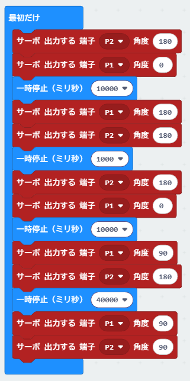
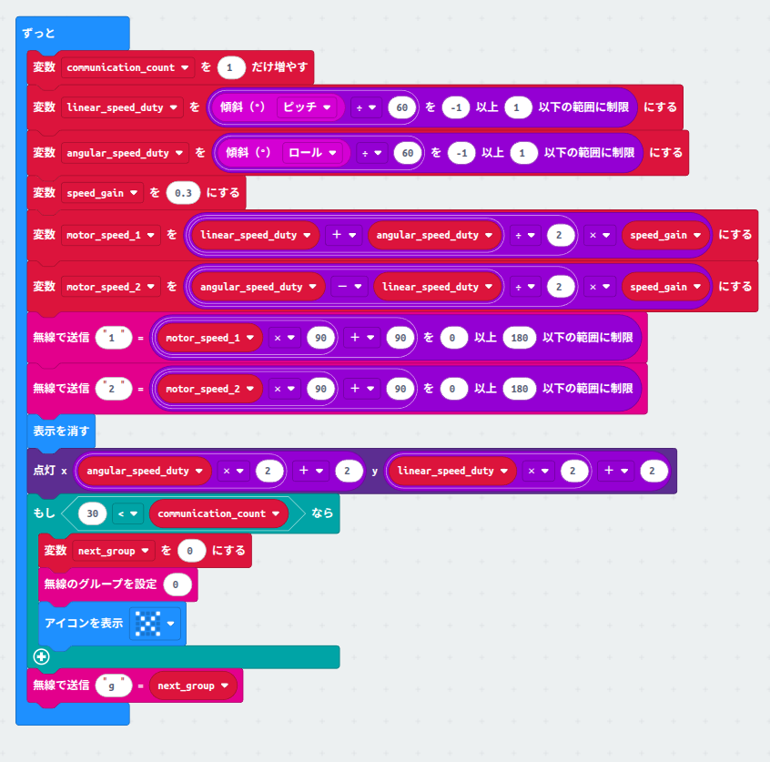
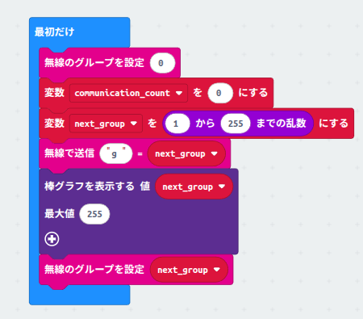
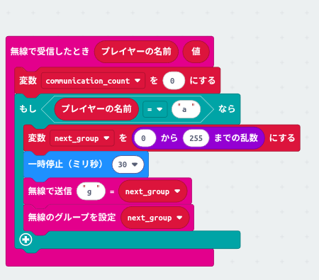
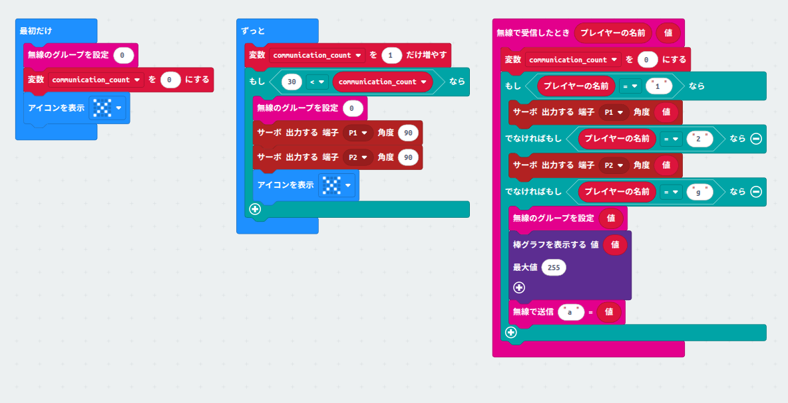
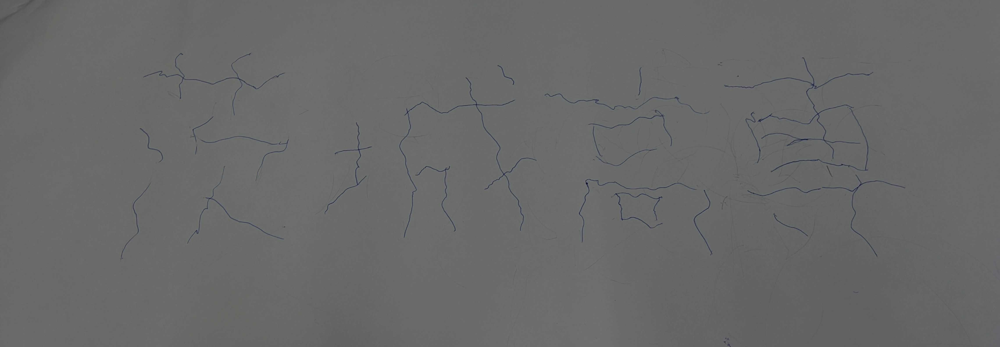

# 実験の目的
小型マイコンボードと周辺機器を用いたシステムの発案・設計・実装

## サンプルの実行
PWMの値に応じて無限回転サーボモーターが回転する様子を確認できた

## 自律駆動

高専ロボコンの旭川高専を参考に自律駆動のコードを作成した

初手パイロンを移動し、専有ボックスエリアに移動する

専有ボックスをゲートエリアに運んだらその周りをずっと集会するようになっている

参考: https://youtu.be/Rww-ndFlu7c?t=21605

## 遠隔制御
### 送信

### 受信

### 説明
Bluetoothを参考にホッピング機能を実装しました

リモコンが次のグループ(チャンネル)番号を送信し、受信したロボットがそのグループに設定することでグループを変えながら通信できます

ロボットがグループ設定に成功したらACKが返ってくるので通信失敗検出できます

リモコンもロボットも30回以上受信失敗したらグループを0に戻し再度通信が再開します

無線で送信 コマンド名 値  というブロックで無線通信してます

コマンド名で操作がかわります

コマンド名 g はリモコンからロボットにチャンネル指定をします

コマンド名 a はロボットがチャンネル指定コマンドgを受信しチャンネル設定が完了したらリモコンに送られます

コマンド 1,2 はサーボ信号用で値がそのままサーボ出力されます

### リモコン説明

リモコンのroll pitch角度から速度を制御しています

roll pitch角度を±60°でクランプしそれぞれの割合で制御しています

前後に傾けたら前後移動、左右に傾けたら左右旋回をします

speed_gain変数で最大速度を割合で設定できます

点灯ブロックで送信しているコマンドを可視化します

もし30回受診に失敗したらグループを0にし、通信の回復を試みます

next_gourpをランダムな数字にすることでBluetoothのホッピングを再現しています

### ロボット側説明

送られてきたコマンドをもとにモーターを回します

30回連続で受診しなかった場合グループを0にし、速度を0(90)にし、通信回復を試みます

## ドローイング
全員で協力してドローイングを行いました

# 茨城高専
を書きました

# 感想
今回の実験では小型マイコンボードを用いて自律駆動と遠隔制御の両方を実装しました

自律駆動では高専ロボコンの旭川高専の動きを参考にしてコードを作成しました

遠隔制御ではBluetoothのホッピング機能を参考にしてグループを変えながら通信する仕組みを実装しました

無線通信の安定性を高めるためにACK応答や受信失敗時のリセット機能を導入しました

全体を通して小型マイコンボードの扱いに慣れることができ、無線通信の基礎的な仕組みを理解する良い機会となりました

また地磁気やジャイロセンサー、加速度センサーを用いてMadgwickフィルターを実装することで、ロボットの姿勢制御に役立てることができました

直線を書く際に曲がってしまう問題も何度も計測しCovarianceを推定し、Biasを補正することで改善できました
